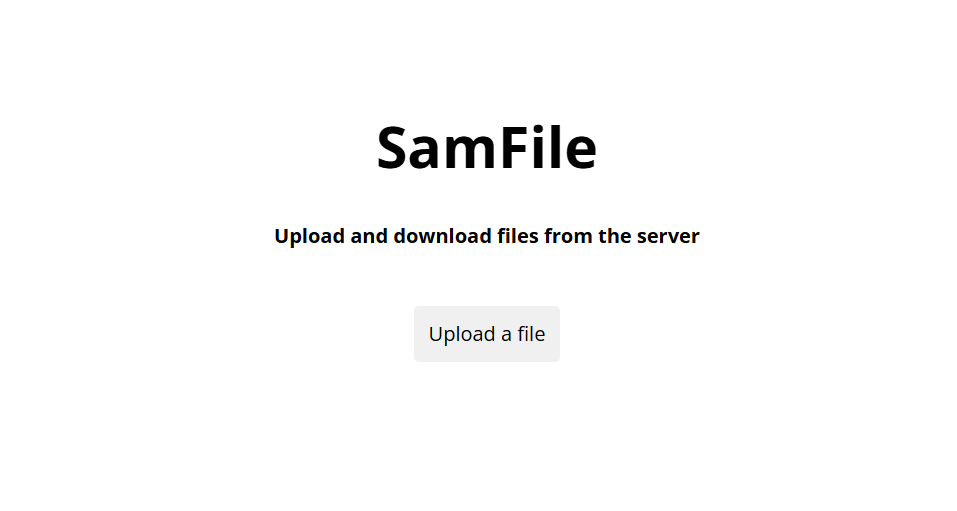
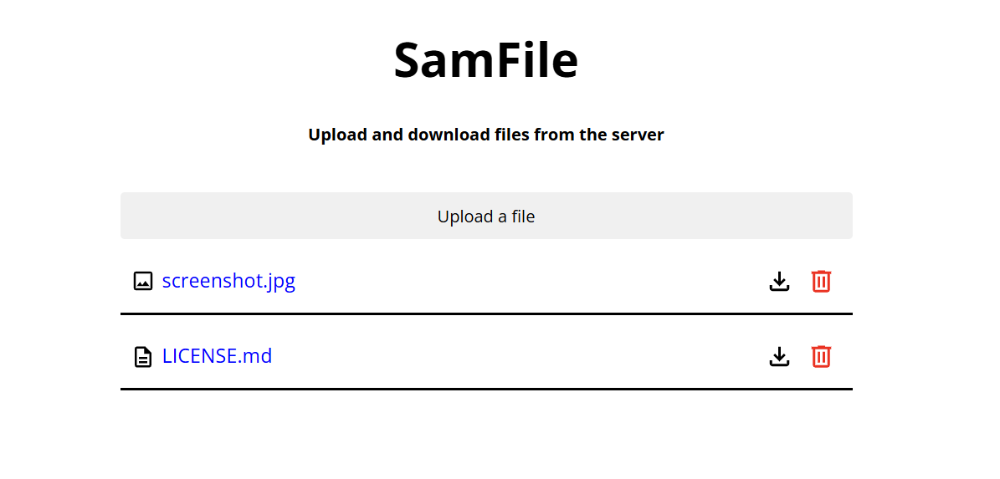

# SamFile

SamFile is a complete file storage system thought for deploying in local or production environments. SamFile includes both frontend and backend systems.

  
📚 Content Table

- [Frontend](#frontend)
- [Backend](#backend)
    - [Routes](#routes)
- [Hosting](#hosting)
    - [Recommendations](#recommendations)
        - [Locally](#locally)
        - [Production](#production)

## Frontend

The frontend of SamFile is developted using [Vite](https://vite.dev) and [React](https://react.dev). It includes a functionality to list the files avaliable in the server and another one for uploading them (logically), also you can download a file and delete it directly by the web.

## Backend

The backend server of this project is made using [Express](https://expressjs.com) and [Node.js](https://nodejs.org). It's got three routes:

### Routes

- `/upload` (POST): Endpoint for uploading file via the POST method.
- `/delete/<id>` (DELETE): This route is be used in order to delete  an especific file of the server
- `/files` (GET): In this endpoint you can get a JSON with the property *files* that contains all the names of the files hosted in the server
- `/video/<id>` (GET): This route returns a web page with a video element with the src of the file especified
- `/file` (GET): In this endpoint are staticly hosted the files of the server (saved in the folder [*uploads*](/backend/uploads/))

## Hosting

There are as infinite possibilities for hosting this system but I let you some recommendations bellow:

### Recommendations

#### Locally

For hosting locally a very good option is a [Raspberry Pi](https://www.raspberrypi.com/), it needs a very little amount of energy to work and it's thought to work with a [Linux-based OS](https://linux.org/) specifically with [Raspberry Pi OS](https://www.raspberrypi.com/software/) so you'll have full control of your system. 

I really recommend you to use the SSH protocol to use your raspberry so that you don't have to connect a monitor, a keyboard, etc to it and you can use your main computer instead.

### Production

A good combo for hosting is [Vercel](https://vercel.com) plus [Firebase](https://firebase.google.com) both have good free versions that (if just you and about 100 users more use it) it's even more than what you need! Other good options for hosting the web are:

- [Netlify](https://netlify.com): similar to Vercel
- [Amazon AWS](https://aws.amazon.com): if you want a challenge 😉
- And much more